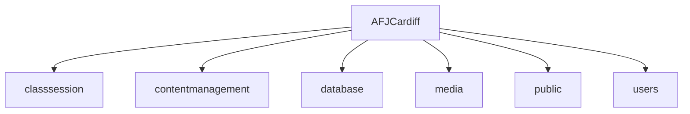
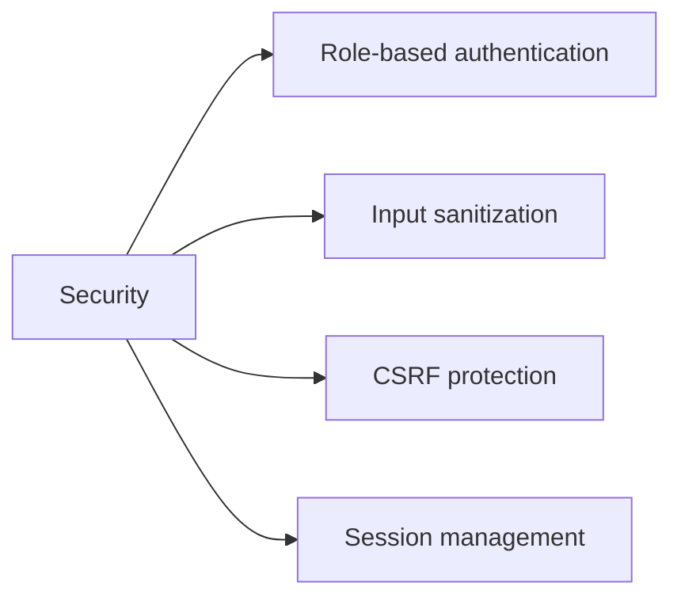
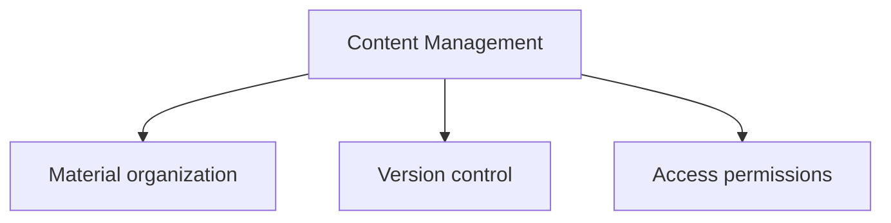
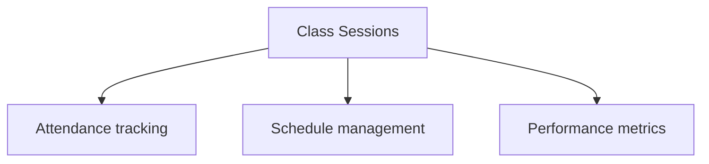
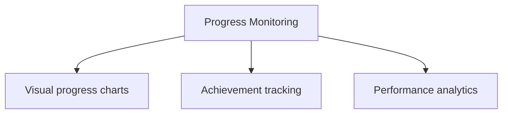

# AFJCardiff Academy Management System


## 🎯 Overview
Enterprise-grade academy management system for AFJCardiff, enabling seamless administration of classes, student progress tracking, and content distribution.

## ⚡ Key Features
- **Content Management**: Organize and distribute training materials
- **Class Sessions**: Track attendance and schedule management
- **Progress Monitoring**: Visual progress tracking for students
- **Media Library**: Centralized media asset management
- **User System**: Role-based access control
- **Analytics**: Performance metrics and reporting

## 🛠️ Tech Stack
- PHP 8.2
- MySQL/MariaDB
- Apache Server
- Bootstrap CSS Framework
- jQuery
- Chart.js

## 🚀 Quick Start
[](https://github.com/codespaces/new)

### Using Codespaces
1. Click "Open in GitHub Codespaces"
2. Wait for environment setup
3. Access via forwarded port 8000

### Local Development
```bash
# Install dependencies
composer install

# Configure database
mysql -u root -e "CREATE DATABASE afjcardiff;"
mysql -u root afjcardiff < database.sql

# Start development server
php -S localhost:8000
```

## 📁 Project Structure


## ⚙️ Configuration
- Database: `config/database.php`
- Application: `config/app.php`
- Environment: `.env`

## 🔒 Security


## 📱 Features Detail
### Content Management


### Class Sessions


### Progress Monitoring


## 🤝 Contributing
1. Fork repository
2. Create feature branch
3. Commit changes
4. Push to branch
5. Open pull request

## 📝 License
MIT License - see LICENSE file

## 🔧 Support
For support, email support@afjcardiff.com

## 🎉 Acknowledgments
- Development Team
- AFJCardiff Staff
- Open Source Community

## 🌍 Background

### AFJ Cardiff: Who We Are
AFJ offers Afro Dance classes in Cardiff as a way of sharing and embracing African culture. We represent dance styles and moves from all over the continent and share this in inclusive environments where everyone feels welcome. Our approach in classes is to merge education with fun, fitness, and culture. Our workshops introduce the opportunity to dig deeper into specific Afro Dance styles and the opportunities to combine other styles with Afro Dance. Since its roots, AFJ has grown significantly and is recognized as Wales’s first Afro Dance dedicated organization.

### What We Currently Offer
- Weekly Open Classes at Ardour Academy, Cardiff
- Monthly collaborator workshops at J1 studios
- Performance Group Class (invite only)
- Performances at community and cultural events
- Private 1-1 classes

### About Our Values
We see dance as a vehicle to share the African Culture and through that to encourage others to embrace their own culture as well. Behind every move there is a story, history and so it expresses identity. Whether you have African and/or Caribbean roots or not, we invite everyone to share their love of Afro Dance, grow as dancers and learn more about the historical significance of different moves and styles, thereby creating a sense of belonging for all. Our values are shaped around:
- Unity: Connecting different people from diverse backgrounds
- Community: Making the joy and heritage of African dance available to all
- Knowledge: Educating and sharing African culture
- Inclusivity: Creating safe spaces that are welcoming and non-judgmental

### Our Mission
That the AFJ community creates unity and respect, which do not readily arise from ‘knowing’, but from ‘experiencing’ the African culture. We aim to break down barriers between people and connect through the joy of dance. For us, dance is a creative tool to educate and share African culture.

### Our Story
"My name is Plamedi Santima-Akiso, I’m 24 years old and I’m originally from Congo. My African culture, including its traditions, music, and dance, is central to who I am and through my upbringing, I have remained connected to my heritage. I came to understand that my passion for dance had a deeper meaning, in the ways in which it can promote, share and educate on African culture. Starting university, I noticed that though many societies promoted community, few catered for my own culture, and – importantly - still attracted others. I wanted people of African and non-African heritage to come together to learn more about our culture and experience some of its beauty. In 2018, I created Wales’s first Afro Dance Society. This first step was significant in setting the foundations and involved classes, performances and events that engaged a wide range of students from all backgrounds. The response was overwhelmingly positive. The society was diverse, and many people were enthused how they had been waiting for something like this to begin in Wales. I had students from different universities in Wales attending and during this time I realised that I had to reach beyond my university and create the same impact for the community in Cardiff. In 2021, with the help of the Enterprise partners of the university I founded my own Afro Dance business, AFJ Cardiff. Now in 2023, we deliver weekly classes and monthly workshops to adults and kids, as well as going into schools, dance organizations and organizing community events, and performances."

### Afro Dance
I’ve documented the origins and evolution of Afro Dance in a short documentary I created here. Today, Afro Dance has become a worldwide sensation through social media and dance challenges which have created unity and broken-down barriers for the new generation. It’s grown in popularity, reaching beyond the continent and is embraced by people from all different cultures.

### The Opportunity in Wales
Afro Dance is shaping global mainstream culture, and our mission is to bring this to Wales. There is an opportunity to harness the popularity of these dance styles and create momentum around what we offer. Although there are challenges as it’s still relatively ‘new’ here, we view this as an opportunity to invest in promoting and highlighting what we do. We’ve seen this happen in London where many of the most influential dancers have thriving businesses both offline and online. Cardiff is a multicultural city which can embrace and appreciate our African heritage.
