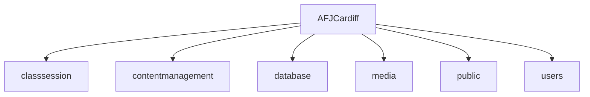
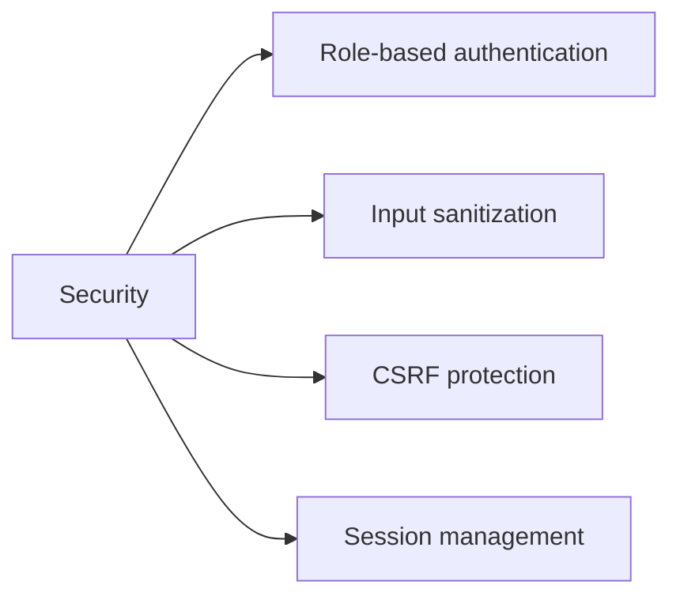
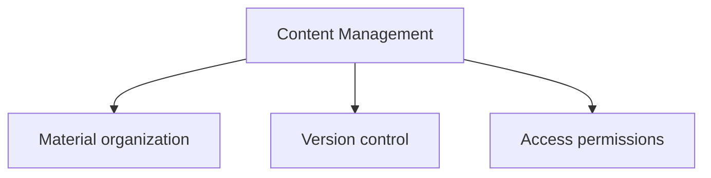
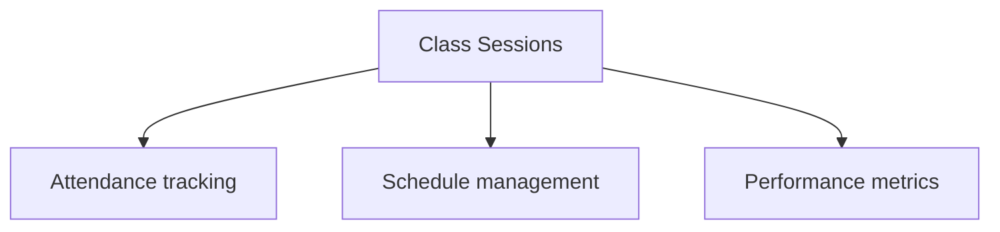
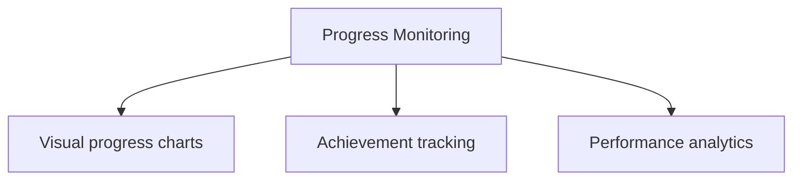

# AFJCardiff Academy Management System


## 🎯 Overview
Enterprise-grade academy management system for AFJCardiff, enabling seamless administration of classes, student progress tracking, and content distribution.

## ⚡ Key Features
- **Content Management**: Organize and distribute training materials
- **Class Sessions**: Track attendance and schedule management
- **Progress Monitoring**: Visual progress tracking for students
- **Media Library**: Centralized media asset management
- **User System**: Role-based access control
- **Analytics**: Performance metrics and reporting

## 🛠️ Tech Stack
- PHP 8.2
- MySQL/MariaDB
- Apache Server
- Bootstrap CSS Framework
- jQuery
- Chart.js

## 🚀 Quick Start
[](https://github.com/codespaces/new)

### Using Codespaces
1. Click "Open in GitHub Codespaces"
2. Wait for environment setup
3. Access via forwarded port 8000

### Local Development
```bash
# Install dependencies
composer install

# Configure database
mysql -u root -e "CREATE DATABASE afjcardiff;"
mysql -u root afjcardiff < database.sql

# Start development server
php -S localhost:8000
```

## 📁 Project Structure


## ⚙️ Configuration
- Database: `config/database.php`
- Application: `config/app.php`
- Environment: `.env`

## 🔒 Security


## 📱 Features Detail
### Content Management


### Class Sessions


### Progress Monitoring


## 🤝 Contributing
1. Fork repository
2. Create feature branch
3. Commit changes
4. Push to branch
5. Open pull request

## 📝 License
MIT License - see LICENSE file

## 🔧 Support
For support, email support@afjcardiff.com

## 🎉 Acknowledgments
- Development Team
- AFJCardiff Staff
- Open Source Community

## 🌍 Background

### AFJ Cardiff: Who We Are
AFJ offers Afro Dance classes in Cardiff as a way of sharing and embracing African culture. We represent dance styles and moves from all over the continent and share this in inclusive environments where everyone feels welcome. Our approach in classes is to merge education with fun, fitness, and culture. Our workshops introduce the opportunity to dig deeper into specific Afro Dance styles and the opportunities to combine other styles with Afro Dance. Since its roots, AFJ has grown significantly and is recognized as Wales’s first Afro Dance dedicated organization.

### What We Currently Offer
- Weekly Open Classes at Ardour Academy, Cardiff
- Monthly collaborator workshops at J1 studios
- Performance Group Class (invite only)
- Performances at community and cultural events
- Private 1-1 classes

### About Our Values
We see dance as a vehicle to share the African Culture and through that to encourage others to embrace their own culture as well. Behind every move there is a story, history and so it expresses identity. Whether you have African and/or Caribbean roots or not, we invite everyone to share their love of Afro Dance, grow as dancers and learn more about the historical significance of different moves and styles, thereby creating a sense of belonging for all. Our values are shaped around:
- Unity: Connecting different people from diverse backgrounds
- Community: Making the joy and heritage of African dance available to all
- Knowledge: Educating and sharing African culture
- Inclusivity: Creating safe spaces that are welcoming and non-judgmental

### Our Mission
That the AFJ community creates unity and respect, which do not readily arise from ‘knowing’, but from ‘experiencing’ the African culture. We aim to break down barriers between people and connect through the joy of dance. For us, dance is a creative tool to educate and share African culture.

### Our Story
Plamedi Santima-Akiso is a 24-year-old originally from Congo. Her African culture, including its traditions, music, and dance, is central to her identity, and through her upbringing, she has remained deeply connected to her heritage. Over time, she came to understand that her passion for dance had a deeper meaning—specifically, its power to promote, share, and educate others about African culture.

When she started university, she noticed that while many societies promoted community, few catered to her own culture while also attracting people from different backgrounds. She wanted both African and non-African individuals to come together to learn more about African culture and experience its beauty. In 2018, she took the initiative to create Wales’s first Afro Dance Society. This was a significant step in laying the foundations for what would become a thriving community. The society organized classes, performances, and events that engaged a diverse range of students from various backgrounds. The response was overwhelmingly positive—many people expressed excitement, saying they had been waiting for something like this to start in Wales. The society even attracted students from different universities across Wales.

During this time, she realized that her vision needed to extend beyond the university and into the wider Cardiff community. In 2021, with the support of the university’s Enterprise partners, she founded her own Afro Dance business, AFJ Cardiff. Now, in 2023, AFJ Cardiff delivers weekly classes and monthly workshops for both adults and children, collaborates with schools and dance organizations, and organizes community events and performances.

### Afro Dance
I’ve documented the origins and evolution of Afro Dance in a short documentary I created here. Today, Afro Dance has become a worldwide sensation through social media and dance challenges which have created unity and broken-down barriers for the new generation. It’s grown in popularity, reaching beyond the continent and is embraced by people from all different cultures.

### The Opportunity in Wales
Afro Dance is shaping global mainstream culture, and our mission is to bring this to Wales. There is an opportunity to harness the popularity of these dance styles and create momentum around what we offer. Although there are challenges as it’s still relatively ‘new’ here, we view this as an opportunity to invest in promoting and highlighting what we do. We’ve seen this happen in London where many of the most influential dancers have thriving businesses both offline and online. Cardiff is a multicultural city which can embrace and appreciate our African heritage.

## 📚 Detailed Instructions

### Setting Up the Repository

1. **Clone the Repository**
   ```bash
   git clone https://github.com/yourusername/afjcardiff.git
   cd afjcardiff
   ```

2. **Install Dependencies**
   ```bash
   composer install
   ```

3. **Configure Environment Variables**
   - Copy the `.env.example` file to `.env`:
     ```bash
     cp .env.example .env
     ```
   - Update the `.env` file with your database credentials and other configuration settings.

4. **Run Database Migrations**
   ```bash
   php artisan migrate
   ```

5. **Seed the Database**
   ```bash
   php artisan db:seed
   ```

6. **Start the Development Server**
   ```bash
   php -S localhost:8000 -t public
   ```

### Using the Application

1. **Access the Application**
   - Open your web browser and navigate to `http://localhost:8000`.

2. **Admin Login**
   - Use the default admin credentials to log in:
     - **Username**: `admin`
     - **Password**: `password`

3. **Managing Classes**
   - Navigate to the "Classes" section to manage class sessions, attendance, and schedules.

4. **Content Management**
   - Use the "Content Management" section to organize and distribute training materials.

5. **Progress Monitoring**
   - Track student progress and performance metrics in the "Progress Monitoring" section.

6. **Media Library**
   - Manage media assets in the "Media Library" section.

7. **User System**
   - Configure role-based access control in the "User System" section.

8. **Analytics**
   - View performance metrics and generate reports in the "Analytics" section.

### Dependencies and Requirements

- **PHP 8.2**: Ensure you have PHP 8.2 installed on your system.
- **Composer**: Dependency management tool for PHP.
- **MySQL/MariaDB**: Database server for storing application data.
- **Apache Server**: Web server for serving the application.
- **Node.js and npm**: Required for managing frontend dependencies (optional).

### Testing

1. **Run Unit Tests**
   ```bash
   php artisan test
   ```

2. **Run Integration Tests**
   ```bash
   php artisan test --group=integration
   ```

3. **Run Feature Tests**
   ```bash
   php artisan test --group=feature
   ```

### Deployment

1. **Build for Production**
   ```bash
   npm run production
   ```

2. **Deploy to Server**
   - Follow your preferred deployment process to upload the application to your production server.

3. **Configure Environment Variables**
   - Update the `.env` file on your production server with the appropriate configuration settings.

4. **Run Database Migrations**
   ```bash
   php artisan migrate --force
   ```

5. **Seed the Database**
   ```bash
   php artisan db:seed --force
   ```

6. **Restart Server**
   - Restart your web server to apply the changes.

### Troubleshooting

- **Database Connection Issues**
  - Ensure your database credentials in the `.env` file are correct.
  - Verify that the database server is running and accessible.

- **Permission Errors**
  - Check file and directory permissions to ensure the web server can read and write to the necessary files.

- **Missing Dependencies**
  - Run `composer install` and `npm install` to ensure all dependencies are installed.

- **Configuration Errors**
  - Double-check the configuration settings in the `.env` file for any typos or missing values.

### Additional Resources

- **Laravel Documentation**: [https://laravel.com/docs](https://laravel.com/docs)
- **Composer Documentation**: [https://getcomposer.org/doc](https://getcomposer.org/doc)
- **MySQL Documentation**: [https://dev.mysql.com/doc](https://dev.mysql.com/doc)
- **Apache Documentation**: [https://httpd.apache.org/docs](https://httpd.apache.org/docs)
- **Node.js Documentation**: [https://nodejs.org/en/docs](https://nodejs.org/en/docs)

### Contact

For any questions or support, please contact the development team at support@afjcardiff.com.
